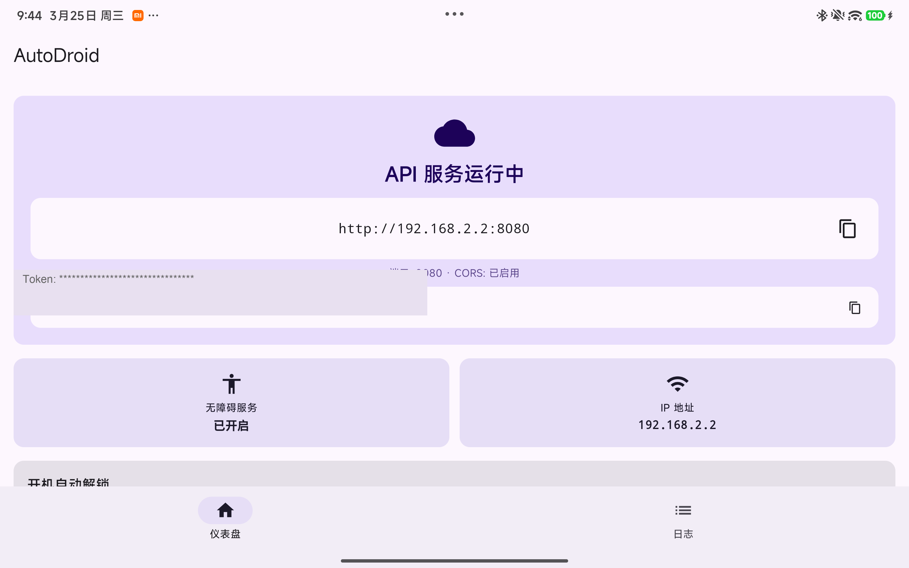
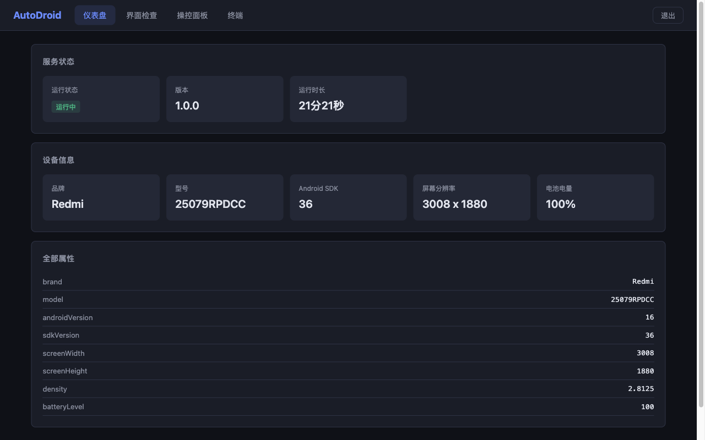
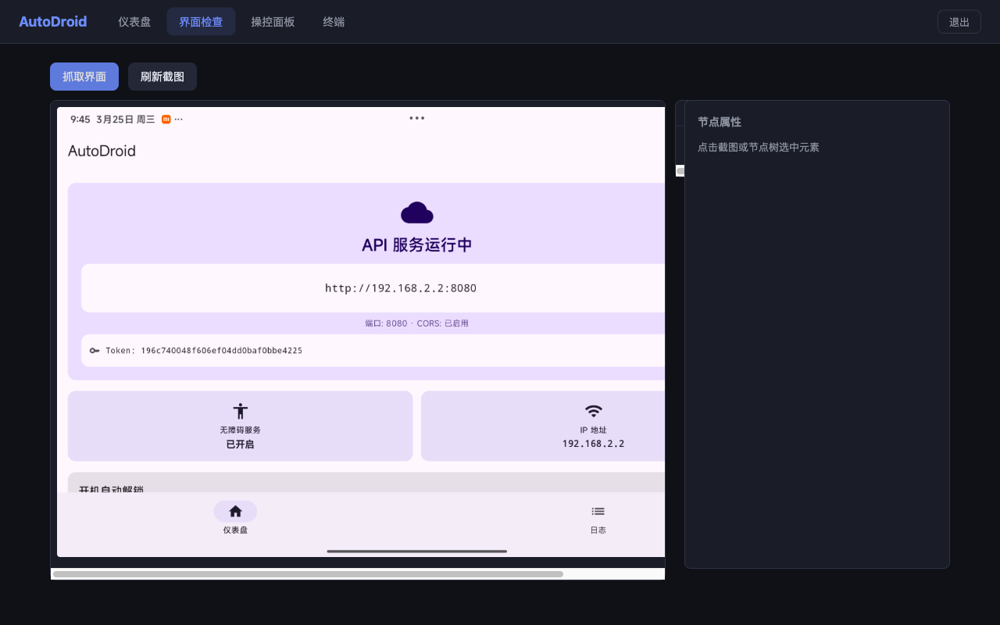
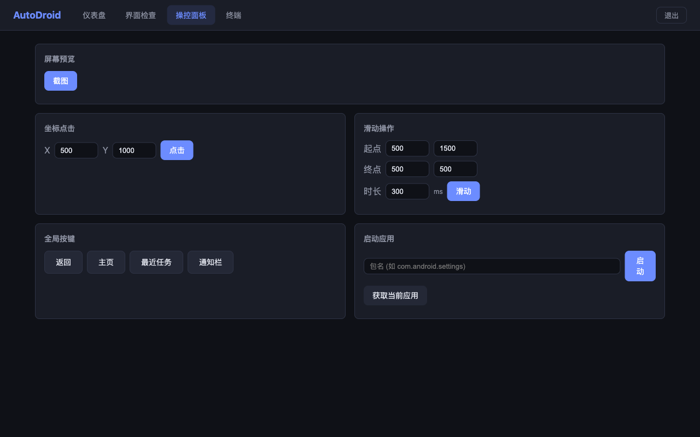
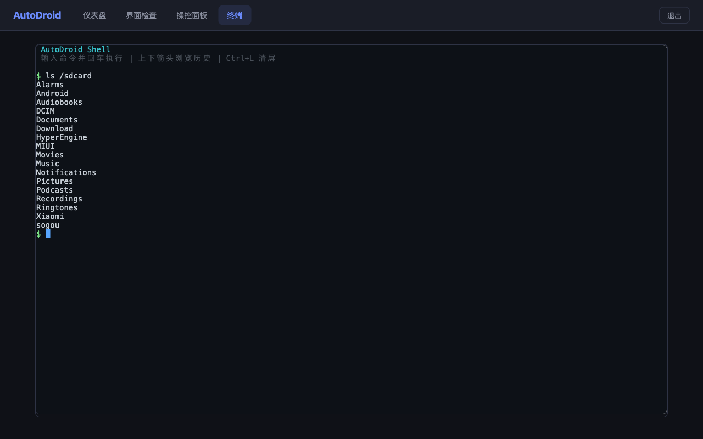

[English](README.md) | [中文](README_zh.md)

# AutoDroid

Android automation platform with HTTP REST API. Control any Android device programmatically — tap, swipe, inspect UI trees, execute shell commands, capture screenshots — all through a clean REST interface.

## Screenshots

| Android App | Web Dashboard |
|:-----------:|:-------------:|
|  |  |

| UI Inspector | Controls | Terminal |
|:------------:|:--------:|:--------:|
|  |  |  |

## Features

- **UI Automation** — Find elements by selector, click, input text, scroll, wait for elements
- **Screen Capture** — JPEG screenshots with configurable quality/scale, 500ms smart caching
- **Accessibility Tree** — Full multi-window UI hierarchy dump as JSON
- **Shell Execution** — Run arbitrary shell commands with stdout/stderr capture
- **Gesture Control** — Click, swipe, long press, multi-point gestures, hardware keys
- **File Operations** — List, read, write, delete files within sandbox
- **Event Streaming** — Real-time accessibility and key events via Server-Sent Events (SSE)
- **Web Dashboard** — Built-in React UI for device inspection and control
- **Token Auth** — Dual-scope (read/full) token authentication with rate limiting

## Quick Start

### Prerequisites

- Android device (SDK 26+, Android 8.0+)
- Android Studio or Gradle
- Node.js 18+ (for web frontend)
- ADB connected to the device

### Build & Install

```bash
# Build web frontend
cd web && npm install && npm run build && cd ..

# Build and install APK
./gradlew :app:assembleDebug
adb install -r app/build/outputs/apk/debug/app-debug.apk
```

### Setup on Device

1. Launch **AutoDroid** app
2. Grant **Accessibility Service** permission when prompted
3. Note the **API Token** shown on the dashboard
4. Set up port forwarding: `adb forward tcp:8080 tcp:8080`

### First API Call

```bash
# Check server status (no auth required)
curl http://127.0.0.1:8080/api/status

# Get device info
curl -H "Authorization: Bearer YOUR_TOKEN" http://127.0.0.1:8080/api/device/info

# Take a screenshot
curl -H "Authorization: Bearer YOUR_TOKEN" http://127.0.0.1:8080/api/screenshot -o screen.jpg

# Tap at coordinates
curl -H "Authorization: Bearer YOUR_TOKEN" -X POST \
  http://127.0.0.1:8080/api/actions/click -d '{"x":500,"y":500}'

# Dump UI tree
curl -H "Authorization: Bearer YOUR_TOKEN" http://127.0.0.1:8080/api/ui/dump

# Execute shell command
curl -H "Authorization: Bearer YOUR_TOKEN" -X POST \
  http://127.0.0.1:8080/api/shell/exec -d '{"command":"ls /sdcard"}'
```

## API Reference

All responses use a standard envelope: `{"success": true/false, "data": ..., "timestamp": ...}`

### Status & Device

| Method | Endpoint | Auth | Description |
|--------|----------|------|-------------|
| GET | `/api/status` | No | Server version, uptime, service status |
| GET | `/api/device/info` | READ | Device model, Android version, screen size, battery |

### UI Automation

| Method | Endpoint | Auth | Description |
|--------|----------|------|-------------|
| GET | `/api/ui/dump` | READ | Full accessibility tree (all windows) |
| POST | `/api/ui/find` | FULL | Find elements by selector |
| POST | `/api/ui/click` | FULL | Click element by selector |
| POST | `/api/ui/input` | FULL | Input text into element |
| POST | `/api/ui/scroll` | FULL | Scroll element |
| POST | `/api/ui/wait` | FULL | Wait for element to appear |

### Actions

| Method | Endpoint | Auth | Description |
|--------|----------|------|-------------|
| POST | `/api/actions/click` | FULL | Tap at coordinates `{x, y}` |
| POST | `/api/actions/swipe` | FULL | Swipe gesture `{x1, y1, x2, y2, duration}` |
| POST | `/api/actions/gesture` | FULL | Multi-point gesture |
| POST | `/api/actions/key` | FULL | Hardware key (home, back, recents, etc.) |

### Screen Capture

| Method | Endpoint | Auth | Description |
|--------|----------|------|-------------|
| GET | `/api/screenshot` | READ | JPEG screenshot. Params: `quality` (1-100), `scale` (0.1-1.0) |

### Shell & Files

| Method | Endpoint | Auth | Description |
|--------|----------|------|-------------|
| POST | `/api/shell/exec` | FULL | Execute shell command `{command}` |
| GET | `/api/files/list` | READ | List directory. Param: `path` |
| GET | `/api/files/read` | READ | Read file content. Param: `path` |
| POST | `/api/files/write` | FULL | Write file `{path, content, append?}` |
| DELETE | `/api/files/delete` | FULL | Delete file. Param: `path` |

### Events & Logs

| Method | Endpoint | Auth | Description |
|--------|----------|------|-------------|
| GET | `/api/events/stream` | READ | SSE stream of accessibility events |
| GET | `/api/logs` | READ | Server logs. Params: `limit`, `offset` |
| GET | `/api/logs/stream` | READ | SSE stream of log events |
| DELETE | `/api/logs` | FULL | Clear logs |

### Auth

| Method | Endpoint | Auth | Description |
|--------|----------|------|-------------|
| POST | `/api/auth/rotate-tokens` | FULL | Rotate API tokens (old tokens invalidated immediately) |

## Architecture

```
Browser/Client --> HTTP REST API (port 8080) --> Controllers --> Adapters --> Android System APIs
                                                     |
                                            StaticController --> assets/web/ (React SPA)
```

- **HTTP Server** — Custom raw-socket server with coroutine-per-connection model, Express-like routing, middleware pipeline (CORS, Auth, Logger)
- **Controllers** — Thin request/response layer, 11 controllers for different API domains
- **Adapters** — 5 singleton adapters (Automator, App, Device, Shell, Event) wrapping Android APIs via Hilt DI
- **Automator Engine** — Separate Gradle module for UI tree traversal, selector parsing, gesture dispatch
- **Web Frontend** — React 19 + TypeScript + Vite, built to `assets/web/` and served as static files

## Security

- **Token Authentication** — Dual-scope tokens (READ for GET, FULL for mutations). 128-bit SecureRandom, stored in EncryptedSharedPreferences (AES-256-GCM)
- **Rate Limiting** — 5 auth failures trigger exponential backoff (1s-32s) per IP
- **Path Traversal Protection** — Canonical path validation for all file operations
- **Header Injection Prevention** — CR/LF stripped from all response headers
- **URL Normalization** — Path decoded and normalized before auth check
- **CORS** — Configurable, defaults to private IP ranges

> **Note**: HTTP is plaintext. Use on trusted networks only, or via `adb forward` for local access.

## Tech Stack

| Layer | Technology |
|-------|-----------|
| Language | Kotlin 2.1, Coroutines 1.9 |
| DI | Hilt 2.53 |
| Testing | JUnit5, MockK |
| Frontend | React 19, TypeScript 5.9, Vite 8 |
| Min SDK | 26 (Android 8.0) |
| Target SDK | 35 |

## Development

```bash
# Run automator unit tests (62 tests)
./gradlew :automator:test

# Run app unit tests
./gradlew :app:testDebugUnitTest

# Web frontend dev server (proxies /api to localhost:8080)
cd web && npm run dev

# TypeScript type check
cd web && npx tsc --noEmit
```

## License

[Apache License 2.0](LICENSE)
